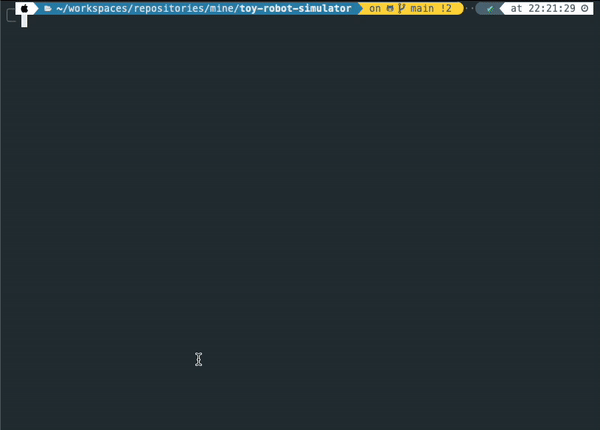

# toy-robot-simulator
This command line application takes user input as a list of instructions and outputs the final position of the robot.

## Running the application locally
Step 1: Install dependencies
```
npm install
```
Step 2: Run with input
```
npm start
```
(See example below)
</hr>
